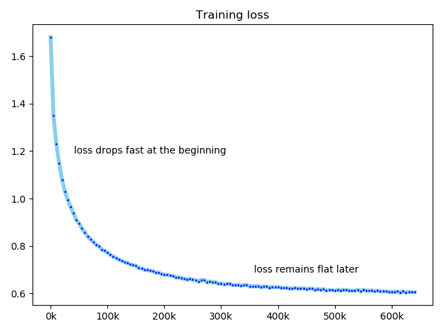

## Transformers for English to Chinese Translation  (微调transformers从英文到中文的翻译器).

<!--This repository comes with [the blog](#). -->

### [Demo](demo.py)

```python
# pip install transformers
from transformers import AutoTokenizer, AutoModelWithLMHead
tokenizer = AutoTokenizer.from_pretrained("congcongwang/bart-base-en-zh")
model = AutoModelWithLMHead.from_pretrained("congcongwang/bart-base-en-zh")	
examples = ["Truth, good and beauty have always been considered as the three top pursuits of human beings",
            "Warm wind caresses my face",
            "Sang Lan is one of the best athletes in our country."]
inputs = tokenizer(examples,padding=True, return_tensors="pt")
outputs = model.generate(**inputs,max_length=128)
print([tokenizer.decode(ids,skip_special_tokens=True) for ids in outputs])
# print
# ['真理、善和美，一直被认为是人类的三大追求。', '温暖的风抚摸我的脸', '萨兰是我国最好的运动员之一。']
```
 
### Customize fine-tuning

#### Get ready
```bash
git clone https://github.com/wangcongcong123/transection
cd transection
pip install -e .
```
#### Prepare data
The data set used as an example here is the translation2019zh from [this repository](https://github.com/brightmart/nlp_chinese_corpus) that has around 5M English to Chinese training pairs and around 40K validation examples. We only use the training set for fine-tuning and the validation set at test time.

Here is [a pre-processed version of the train set](https://ucdcs-student.ucd.ie/~cwang/data/translation_2019zh/train.zip) that are already converted to jsonl format, where each line is like:  `{"english":"...","chinese":"..."}`. Feel free to change your customized data to this format.

Download [the train set](https://ucdcs-student.ucd.ie/~cwang/data/translation_2019zh/train.zip) and replace it with `./data/train.json` where the `validation set` is also in.

Then fine-tuning it by simply running the following script:

```bash
python train.py
```

This script has a set of default parameters as follows:

```json
{
  "model_select": "facebook/bart-base",
  "per_device_train_batch_size": 8,
  "num_epochs_train": 1,
  "log_steps": 5000,
  "max_src_length": 128,
  "max_tgt_length": 128,
  "lr": 0.0002,
  "scheduler": "constantlr",
  "seed": 122,
  "do_train": true,
  "use_tb": true,
  "do_eval": false,
  "dataset_name": "translation",
  "output_path": "tmp/pt_bart-base_translation",
  "from_pretrained": true,
  "batch_size": 8,
  "grad_norm_clip": 1.0,
  "n_gpu": 1,
  "optimizer": "adamW",
  "visible_devices": "0"
}
```

This takes around `30` hours on a RTX 2070 Super GPU. At the end of the epoch, a checkpoint is saved, which is extactly the one used in the demo section. Notice: the above list of hyperparameters may not be the best in the final model's performance due to computational resources constraints. Free free to increase the batch size, training data, mode size or attempting different learning rate scenarios if you have more GPUs and times. It is straightforward to adjust the parameters if taking a look at the [train.py](train.py) script. The script takes care of loading the data in batches from disk with dynamic batching thanks to HF's datasets and transformers APIs instead of loading all data into memory at one time. This well avoids out of RAM problems.

The following plots the training loss trend using the default parameters ([plot_loss.py](plot_loss.py)):

<p align="center">
    <br>
    
    <br>
<p>

### Evaluation

As commonly practiced in the literature, we use sacrebleu here to measure the performance of the trained models. As a comparison, the checkpoint `Helsinki-NLP/opus-mt-en-zh` from [HF's models hub](https://huggingface.co/Helsinki-NLP/opus-mt-en-zh) is measured as well. The checkpoint is what I can found the most popular one (as indicated by the number of being downloaded) in English to Chinese translation in the hub. Notice: the `opus-mt-en-zh` checkpoint is trained based on [a smaller BART](extra/opus-mt-en-zh) with around 77M parameters (as compared to [ours here](extra/bart-base) with around 139M parameters) but it is trained on a collection of 41M pairs that are around 8 times of the customized one described in this repository.

```bash
python evaluate.py --model_path Helsinki-NLP/opus-mt-en-zh
python evaluate.py --model_path congcongwang/bart-base-en-zh
```
This will take a while to finish as they are evaluated on [the validation set](data/val.json) with around 40k examples.

The following table presents their sacrebleu scores.

| Models                       | sacrebleu |
|------------------------------|-----------|
| [Helsinki-NLP/opus-mt-en-zh](https://huggingface.co/Helsinki-NLP/opus-mt-en-zh)   | 20.7205   |
| [congcongwang/bart-base-en-zh](https://huggingface.co/congcongwang/bart-base-en-zh) | 24.3759   |

** Please take a grain of salt for the sacrebleu scores since they are evaluated on the validation set that is in-domain similar to the training set that is used for training `congcongwang/bart-base-en-zh` not for `Helsinki-NLP/opus-mt-en-zh`. Hence, it is very likely that `Helsinki-NLP/opus-mt-en-zh` performs much better than `congcongwang/bart-base-en-zh` in [its test set](https://object.pouta.csc.fi/Tatoeba-MT-models/eng-zho/opus-2020-07-17.test.txt). This has been an open research question (awkward) regarding deep models's actual generalization capabilities ([REF1](https://arxiv.org/abs/1902.01007), [REF2](https://arxiv.org/abs/2004.02709), [REF3](https://arxiv.org/abs/1911.01547)).

### Contributions

This repository welcomes feedback from the great community in offering advice on optimizing this repository.

### Future work ideas
- Train a sequence-to-sequence BART-base on the dataset from scratch rather than fine-tune from its checkpoint.
- Fine-tune starting from [MarianMT checkpoints](https://huggingface.co/models?filter=marian).
 - Expand the dataset from various domains (i.e, makes it more general overall).

### References
- [Existing En2zh MarianMT Checkpoint](https://huggingface.co/Helsinki-NLP/opus-mt-en-zh)
- [En2zh Dataset](https://github.com/brightmart/nlp_chinese_corpus)
- [BART paper](https://huggingface.co/transformers/model_doc/bart.html)
- [Transformers documentation](https://arxiv.org/abs/1910.13461)
